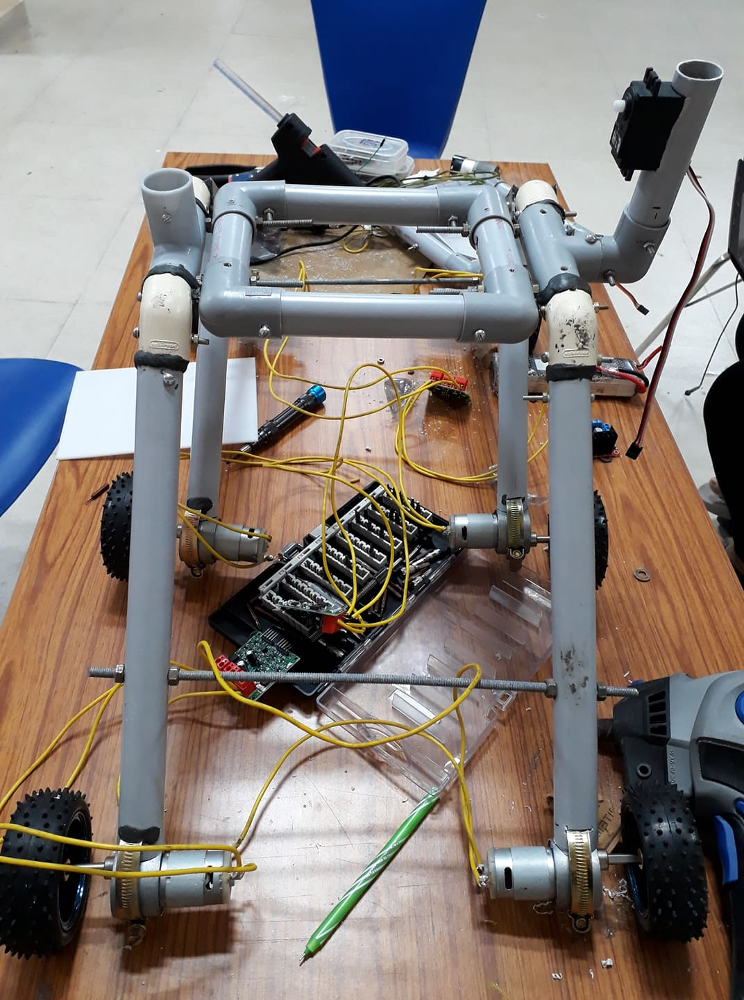

# Stair-climbing-bot-with-load
A mechanical bot that climbs stairs with a self balancing load!! 

# About
In today’s life , technology concerned with the robots plays important role in many fields because they are used to operate in hazardous and urban environments. Some of the robots are designed to operate only on natural terrains , but it can also be used for rough terrains and artificial environments including STAIRWAYS. 

Until recent years, the stair climbing robots were designed with vast hardware and robots were equipped with chain roller to climb stairs or to move on a flat surface. The mechanical design of the this robot contains the fixed and flexible links of WHEEL legs instead of chain roller.

The bot is moving on its six wheels powered by high torque DC motors which enables it to climb up the stair with an ease. The bot is equipped with a self adjusting plate on its top(just like a camera gimbal) which helps to keep the load always in horizontal position. 
The rear arms are rigid while the front arm (basically an elbow joint) is flexible and free to rotate about a horizontal axis thus enabling the front part to get lifted up whenever it encounter a stair. The bot is manually controlled by node MCU.

 

# Initial Phase
We started designing our bot from scratch keeping two points in mind  
   1. The Centre of Mass of the whole system must lie below or at a lower height acoording to the bot. 
   2. The whole bot at any time should be on two stairs only joining its end point or end to end. 
   
So we decided the measurements of the bot keeping these two points in mind. Climbing wasn't a problem as we used 6 high torque motors that provided the necessary torque. The 90 degree V-joint leg which is used in the front is self adjustable and movable according to the terrain thus providing the necessary fluidity in movement of the bot. 

  

# Benefits
This project is definitely going to be highly beneficial for society when used in its full potential. Of course it can perform some usual tasks like carrying stuffs up and down but with some modifications it can be highly helpful for physically challenged people for moving up and down in buildings especially those which don’t have lifts installed in them which is generally not installed in smaller buildings.

# Achievements

1.The project is in working phase. 
2. A balancing plate has been installed which remains horizontal always even during the time of climbing stair thus keeping the load in place. 
3. It is faster than its previous counterparts which used joint legs for climbing.

